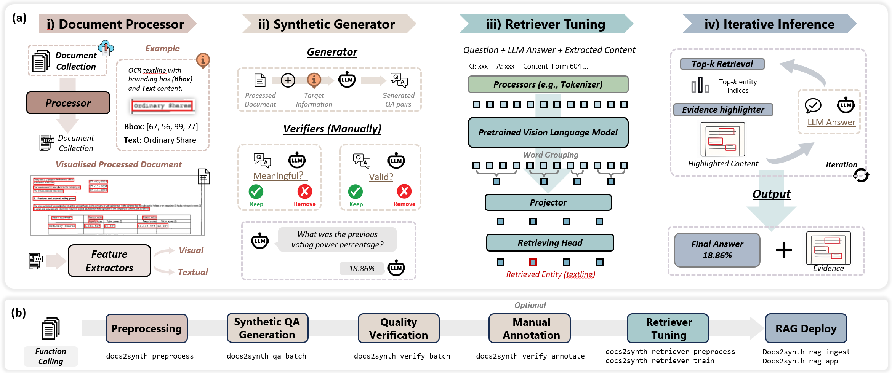
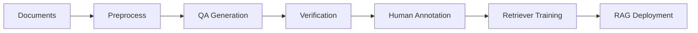

# Docs2Synth

<div style="text-align: center; margin: 2rem 0;">
  <h2 style="font-size: 2rem; font-weight: 700; margin-bottom: 1rem;">
    A Synthetic Data Tuned Retriever Framework for Visually Rich Documents Understanding
  </h2>
  <p style="font-size: 1.2rem; color: var(--md-default-fg-color--light);">
    A complete pipeline for converting, synthesizing, and training retrievers for your document datasets
  </p>
</div>



---

## :sparkles: Key Features

<div class="feature-grid" markdown>

<div class="feature-card" markdown>

### :page_facing_up: Document Processing

Extract structured text and layout from PDFs and images using **Docling**, **PaddleOCR**, or **PDFPlumber**. Support for complex layouts and 80+ languages.

[Learn more →](workflow/document-processing.md){ .md-button .md-button--primary }

</div>

<div class="feature-card" markdown>

### :robot: Agent-Based QA Generation

Automatically generate high-quality **question-answer pairs** using LLMs. Built-in verification with meaningfulness and correctness checkers.

[Learn more →](workflow/qa-generation.md){ .md-button .md-button--primary }

</div>

<div class="feature-card" markdown>

### :brain: Retriever Training

Train custom document retrievers using **LayoutLMv3** or **BERT** on your annotated data. Support for layout-aware and semantic retrieval.

[Learn more →](workflow/retriever-training.md){ .md-button .md-button--primary }

</div>

<div class="feature-card" markdown>

### :rocket: RAG Deployment

Deploy RAG systems instantly with **naive**, **iterative**, or custom strategies. Vector store integration with semantic search.

[Learn more →](workflow/rag-path.md){ .md-button .md-button--primary }

</div>

<div class="feature-card" markdown>

### :chart_with_upwards_trend: Benchmarking

Comprehensive evaluation with **ANLS**, **Hit@K**, **MRR**, and **NDCG** metrics. Track training progress and model performance.

[Learn more →](workflow/retriever-training.md){ .md-button .md-button--primary }

</div>

<div class="feature-card" markdown>

### :gear: Extensible Pipeline

Modular architecture with pluggable components. Easy customization of QA strategies, verifiers, and retrieval methods.

[Get Started →](#quick-start){ .md-button .md-button--primary }

</div>

</div>

---

!!! tip "🔌 MCP Integration"
    Run Docs2Synth as a **remote MCP server** (SSE transport) for AI agents like Claude Desktop, ChatGPT, and Cursor. Access document processing capabilities from your AI tools.

    ```bash
    # Start remote MCP server
    docs2synth-mcp sse --host 0.0.0.0 --port 8009
    ```

    [Learn more about MCP Integration →](mcp-integration.md){ .md-button }

## Installation

### PyPI Installation (Recommended)

**CPU Version (includes all features + MCP server):**
```bash
pip install docs2synth[cpu]
```

**GPU Version (includes all features + MCP server):**
```bash
# Standard GPU installation (no vLLM)
pip install docs2synth[gpu]

# With vLLM for local LLM inference (requires CUDA GPU)
# 1. Install PyTorch with CUDA first:
pip install torch torchvision torchaudio --index-url https://download.pytorch.org/whl/cu128

# 2. Install docs2synth with vLLM:
pip install docs2synth[gpu,vllm]

# 3. Uninstall paddlex to avoid conflicts with vLLM:
pip uninstall -y paddlex
```

!!! warning "vLLM and PaddleX Conflict"
    PaddleX conflicts with vLLM. If you need vLLM support for local LLM inference, you **must** uninstall paddlex after installation: `pip uninstall -y paddlex`

**Minimal Install (CLI only, no ML/MCP features):**
```bash
pip install docs2synth
```

### From GitHub (Development)

```bash
pip install git+https://github.com/AI4WA/Docs2Synth.git
```

## Quick Start

**Automated setup (recommended):**
```bash
git clone https://github.com/AI4WA/Docs2Synth.git
cd Docs2Synth
./setup.sh         # Unix/macOS/WSL
# setup.bat        # Windows
```

The script installs [uv](https://github.com/astral-sh/uv) and sets up everything automatically.

**Manual setup:**
```bash
git clone https://github.com/AI4WA/Docs2Synth.git
cd Docs2Synth
pip install -e ".[dev]"
cp config.example.yml config.yml
# Edit config.yml and add your API keys
```

See the [README](https://github.com/AI4WA/Docs2Synth#readme) for details.

## Workflow



### 🚀 Quick Start: Automated Pipeline

Run the complete end-to-end pipeline with a single command:

```bash
docs2synth run
```

This automatically chains: preprocessing → QA generation → verification → retriever training → validation → RAG deployment.

### Manual Step-by-Step Workflow

For more control, run each step individually:

```bash
# 1. Preprocess documents
docs2synth preprocess data/raw/my_documents/

# 2. Generate QA pairs
docs2synth qa batch

# 3. Verify quality
docs2synth verify batch

# 4. Annotate (opens UI)
docs2synth annotate

# 5. Train retriever
docs2synth retriever preprocess
docs2synth retriever train --mode standard --lr 1e-5 --epochs 10

# 6. Deploy RAG
docs2synth rag ingest
docs2synth rag app
```

[**Complete Workflow Guide →**](workflow/complete-workflow.md){ .md-button .md-button--primary }

## Architecture

```
Docs2Synth/
├── integration/    # Integration utilities
├── preprocess/     # Document preprocessing
├── qa/            # QA generation and verification
├── retriever/     # Retriever training and inference
├── rag/           # RAG strategies
└── utils/         # Logging, timing, and utilities
```

## Contributing

We welcome contributions! Please see our [GitHub repository](https://github.com/AI4WA/Docs2Synth) for guidelines.

## License

This project is licensed under the [MIT License](https://github.com/AI4WA/Docs2Synth/blob/main/LICENSE).

## Support

- Report issues: [GitHub Issues](https://github.com/AI4WA/Docs2Synth/issues)
- Documentation: [Full documentation](https://github.com/AI4WA/Docs2Synth)
