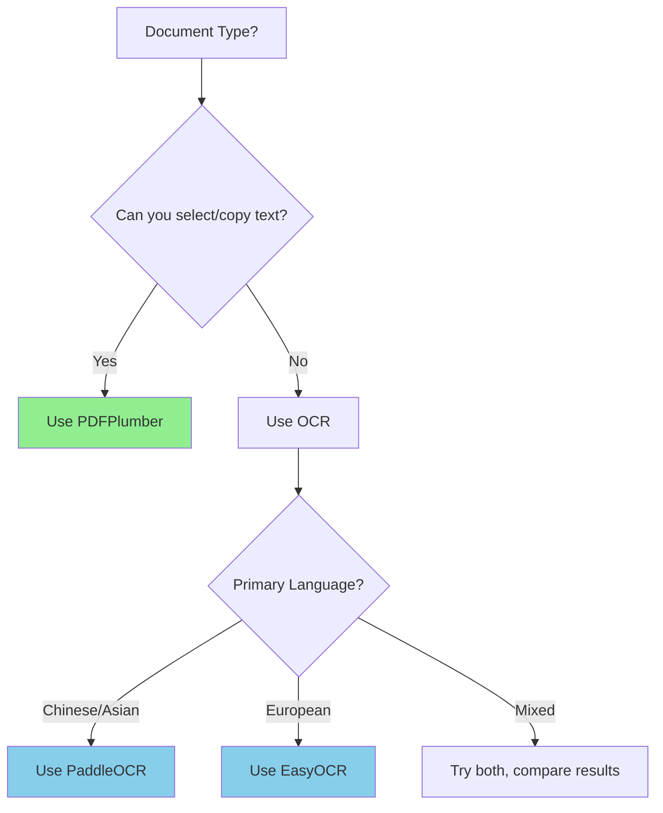

# Document Processing

Docs2Synth provides multiple document processors to extract structured text and layout information from various document formats. Each processor is optimized for different document types and use cases.

## Overview

Document processing is the first step in the Docs2Synth pipeline. It converts raw documents (PDFs, images) into structured JSON format containing:

- **Text content** with bounding boxes
- **Reading order** information
- **Page structure** and metadata
- **Processing metadata** (processor used, timing, etc.)

## Available Processors

### PaddleOCR

**Best for**: General-purpose OCR, multilingual documents, Chinese/Asian languages

**License**: Apache 2.0 ✅

```bash
docs2synth preprocess /path/to/images --processor paddleocr --lang en
```

??? example "Python API"
    ```python
    from docs2synth.preprocess.paddleocr import PaddleOCRProcessor

    processor = PaddleOCRProcessor(lang="en", device="gpu")
    result = processor.process("document.png")

    # Access extracted text
    for obj_id, obj in result.objects.items():
        print(f"[{obj.page}] {obj.text} @ {obj.bbox}")
    ```

**Features**:

- :material-translate: 80+ languages supported
- :material-gpu: GPU acceleration with CUDA
- :material-text-box: Text detection + recognition
- :material-target: Bounding boxes with confidence scores

**Supported formats**: Images (PNG, JPG, etc.), scanned PDFs

---

### PDFPlumber

**Best for**: Parsed PDFs with embedded text layers (digital documents)

**License**: MIT ✅

```bash
docs2synth preprocess /path/to/pdfs --processor pdfplumber
```

??? example "Python API"
    ```python
    from docs2synth.preprocess.pdfplumber_proc import PDFPlumberProcessor

    processor = PDFPlumberProcessor(
        extract_tables=True,      # Extract tables as separate objects
        skip_non_pdf=True,         # Auto-skip image files
        min_text_threshold=10      # Warn if PDF has < 10 chars
    )
    result = processor.process("document.pdf")
    ```

**Features**:

- :material-lightning-bolt: Very fast (no OCR needed)
- :material-text: Word-level bounding boxes
- :material-table: Optional table extraction
- :material-file-multiple: Multi-page support
- :material-shield-check: Automatic file validation

!!! warning "Important"
    PDFPlumber only works with text-based PDFs (where you can select/copy text). For scanned PDFs, use PaddleOCR or EasyOCR instead.

**File Validation**:

PDFPlumber automatically validates input files:

- ✅ Checks if file is a PDF (magic bytes + extension)
- ✅ Detects if PDF has extractable text
- ✅ Skips non-PDF files (images) by default
- ✅ Warns if PDF appears to be scanned

```python
# Default: skip non-PDF files gracefully
processor = PDFPlumberProcessor(skip_non_pdf=True)
result = processor.process("image.png")  # Returns empty result + warning

# Strict: raise error on non-PDF files
processor = PDFPlumberProcessor(skip_non_pdf=False)
result = processor.process("image.png")  # Raises ValueError
```

**Supported formats**: PDF files with text layers only

---

### EasyOCR

**Best for**: 80+ languages, easy integration, scanned documents

**License**: Apache 2.0 ✅

```bash
docs2synth preprocess /path/to/images --processor easyocr --lang en
```

??? example "Python API"
    ```python
    from docs2synth.preprocess.easyocr_proc import EasyOCRProcessor

    processor = EasyOCRProcessor(
        lang_list=["en", "fr"],    # Multi-language support
        gpu=True,                   # Use GPU acceleration
        verbose=False               # Quiet mode
    )
    result = processor.process("scanned_doc.png")
    ```

**Features**:

- :material-translate: 80+ languages with pre-trained models
- :material-gpu: GPU acceleration (PyTorch-based)
- :material-text-box: Text detection + recognition
- :material-api: Simpler API than PaddleOCR
- :material-quality-high: High accuracy on complex layouts

**Multi-language examples**:

=== "French + English"
    ```python
    processor = EasyOCRProcessor(lang_list=["fr", "en"])
    ```

=== "Chinese + English"
    ```python
    processor = EasyOCRProcessor(lang_list=["ch_sim", "en"])
    ```

=== "Japanese + English"
    ```python
    processor = EasyOCRProcessor(lang_list=["ja", "en"])
    ```

**Supported formats**: Images (PNG, JPG, etc.), scanned PDFs

---

## Comparison Matrix

| Feature | PaddleOCR | PDFPlumber | EasyOCR |
|---------|-----------|------------|---------|
| **License** | Apache 2.0 | MIT | Apache 2.0 |
| **Best For** | General OCR | Parsed PDFs | Multi-language |
| **Input Types** | Images, scanned PDFs | Text PDFs only | Images, scanned PDFs |
| **OCR** | ✅ Yes | ❌ No | ✅ Yes |
| **GPU** | ✅ Yes | N/A | ✅ Yes |
| **Languages** | 80+ | N/A | 80+ |
| **Tables** | ❌ No | ✅ Yes | ❌ No |
| **Speed (text PDF)** | Slow (OCR) | ⚡ Very fast | Slow (OCR) |
| **Speed (scanned)** | Fast | N/A | Fast |
| **File Validation** | ❌ No | ✅ Yes | ❌ No |

## Decision Guide



**Use PDFPlumber if**:

- ✅ PDFs have embedded text (digital documents)
- ✅ You want the fastest processing speed
- ✅ You need table extraction
- ✅ Processing mixed directories (auto-skips images)

**Use EasyOCR if**:

- ✅ Documents are scanned images
- ✅ Need 80+ language support with simple API
- ✅ Prefer PyTorch-based models

**Use PaddleOCR if**:

- ✅ Robust Chinese/Asian language support needed
- ✅ Already using PaddlePaddle ecosystem
- ✅ Need proven OCR accuracy

## Output Format

All processors generate consistent `DocumentProcessResult` JSON files:

```json
{
  "objects": {
    "0": {
      "object_id": 0,
      "text": "Sample text",
      "bbox": [100.0, 200.0, 300.0, 250.0],
      "label": "text",
      "page": 0,
      "score": 0.95
    }
  },
  "context": "Full document text...",
  "reading_order_ids": [0, 1, 2],
  "process_metadata": {
    "processor_name": "paddleocr",
    "timestamp": "2024-01-01T00:00:00Z",
    "latency": 1234.5
  },
  "document_metadata": {
    "source": "/path/to/document.pdf",
    "filename": "document.pdf",
    "page_count": 5,
    "language": "en",
    "width": 2480,
    "height": 3508
  }
}
```

### Output Filenames

Output files include the processor name to prevent overwriting:

**Format**: `{filename}_{processor}.json`

**Examples**:

```bash
# Input: report.pdf
# Outputs:
report_paddleocr.json     # OCR results
report_pdfplumber.json    # Fast text extraction
report_easyocr.json       # Alternative OCR
```

This allows you to:

- :material-compare: Compare results from different processors
- :material-speedometer: Use different processors for different purposes
- :material-folder-multiple: Process directories without file conflicts

## Usage Examples

### Basic Usage

=== "CLI"
    ```bash
    # PaddleOCR (default)
    docs2synth preprocess document.pdf --processor paddleocr

    # PDFPlumber (for text-based PDFs)
    docs2synth preprocess document.pdf --processor pdfplumber

    # EasyOCR with language
    docs2synth preprocess image.png --processor easyocr --lang fr
    ```

=== "Python"
    ```python
    from docs2synth.preprocess.runner import run_preprocess

    # Process single file
    num_success, num_failed, outputs = run_preprocess(
        "document.pdf",
        processor="pdfplumber",
        output_dir="./processed"
    )

    # Process directory
    num_success, num_failed, outputs = run_preprocess(
        "/path/to/docs",
        processor="easyocr",
        lang="en"
    )
    ```

### Multiple Processors

Process the same file with different processors to compare results:

```bash
# Fast extraction first
docs2synth preprocess paper.pdf --processor pdfplumber
# → paper_pdfplumber.json

# OCR for comparison
docs2synth preprocess paper.pdf --processor paddleocr
# → paper_paddleocr.json

# Compare results
diff paper_pdfplumber.json paper_paddleocr.json
```

### Batch Processing

=== "Mixed Directory"
    ```bash
    # PDFPlumber auto-skips images
    docs2synth preprocess /mixed/directory --processor pdfplumber

    # EasyOCR for images in same directory
    docs2synth preprocess /mixed/directory --processor easyocr
    ```

=== "Filtered Processing"
    ```bash
    # Process only PDFs
    find /docs -name "*.pdf" | xargs -I {} docs2synth preprocess {} --processor pdfplumber

    # Process only images
    find /docs -name "*.png" -o -name "*.jpg" | xargs -I {} docs2synth preprocess {} --processor easyocr
    ```

### Handling Edge Cases

Check if PDFPlumber skipped a file (scanned PDF):

```bash
# Try PDFPlumber first (fast)
docs2synth preprocess document.pdf --processor pdfplumber

# Check if result is empty (scanned)
if [ $(jq '.objects | length' document_pdfplumber.json) -eq 0 ]; then
    echo "Scanned PDF detected, falling back to OCR"
    docs2synth preprocess document.pdf --processor paddleocr
fi
```

## Advanced Configuration

### GPU Acceleration

=== "PaddleOCR"
    ```bash
    # Auto-detect GPU
    docs2synth preprocess image.png --processor paddleocr

    # Force CPU
    docs2synth preprocess image.png --processor paddleocr --device cpu

    # Force GPU
    docs2synth preprocess image.png --processor paddleocr --device gpu
    ```

=== "EasyOCR"
    ```python
    from docs2synth.preprocess.easyocr_proc import EasyOCRProcessor

    # Enable GPU (default)
    processor = EasyOCRProcessor(lang_list=["en"], gpu=True)

    # Disable GPU
    processor = EasyOCRProcessor(lang_list=["en"], gpu=False)
    ```

### Custom Output Directory

```bash
# Specify output directory
docs2synth preprocess /input/docs \
    --processor pdfplumber \
    --output-dir /output/processed
```

### Table Extraction

```python
from docs2synth.preprocess.pdfplumber_proc import PDFPlumberProcessor

# Enable table extraction
processor = PDFPlumberProcessor(extract_tables=True)
result = processor.process("report.pdf")

# Tables are marked with label="other"
for obj_id, obj in result.objects.items():
    if obj.label == "other":
        print(f"Table found on page {obj.page}:")
        print(obj.text)
```

## Troubleshooting

??? question "PDFPlumber returns empty results"
    **Cause**: PDF is likely scanned (image-based) without text layer.

    **Solution**: Use PaddleOCR or EasyOCR instead:
    ```bash
    docs2synth preprocess document.pdf --processor paddleocr
    ```

??? question "EasyOCR is slow on CPU"
    **Cause**: OCR models are computationally intensive.

    **Solution**: Use GPU acceleration or switch to PDFPlumber for text-based PDFs:
    ```python
    processor = EasyOCRProcessor(lang_list=["en"], gpu=True)
    ```

??? question "PaddleOCR not detecting text"
    **Cause**: Low contrast, unusual fonts, or language mismatch.

    **Solution**: Try adjusting language or using EasyOCR:
    ```bash
    # Specify correct language
    docs2synth preprocess image.png --processor paddleocr --lang ch

    # Or try EasyOCR
    docs2synth preprocess image.png --processor easyocr --lang ch_sim
    ```

??? question "Processing fails on specific files"
    **Cause**: Corrupted files or unsupported formats.

    **Solution**: Check file integrity and format:
    ```bash
    # Check PDF integrity
    pdfinfo document.pdf

    # Verify image format
    file image.png
    ```

## Next Steps

After processing documents, you can:

1. **[Generate QA Pairs](qa-generation.md)**: Create question-answer pairs from processed documents
2. **[Train Retrievers](retriever-training.md)**: Train custom retrieval models on your data
3. **[Build RAG Systems](rag-path.md)**: Integrate into retrieval-augmented generation pipelines

For the complete end-to-end workflow, see the **[Complete Workflow Guide](complete-workflow.md)**.

## API Reference

For detailed API documentation, see:

- [PaddleOCR Processor](../api-reference.md#paddleocr)
- [PDFPlumber Processor](../api-reference.md#pdfplumber)
- [EasyOCR Processor](../api-reference.md#easyocr)
- [Runner Module](../api-reference.md#runner)
